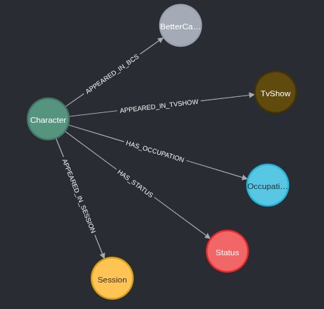

# Atividade-Relacionamentos

Nesta atividade foi criado um grafo a partir dos personagens da série Breaking Bad. O dataset pode ser acessado pelo Kaggle ([link](https://www.kaggle.com/datasets/parthhhpanchal/breaking-bad-datasets))

## Importação dos dados

Por ser um volume pequeno de dados, foi utilizado um único CALL, também não foi feita a criação de índices, porém, em caso de muitas buscas, seria interessante criá-los.

```
CALL {
  LOAD CSV WITH HEADERS FROM 'file:///archive/characters.csv' AS row
  WITH row, 
       split(row.occupation,", ") as occupations, 
       split(row.appearance,", ") as appearances, 
       split(row.category, ", ") as categories, 
       split(row.better_call_saul_appearance, ", ") as better_call_saul_appearances

  MERGE(c:Character{name:row.name})
  SET c.birthday = row.birthday, 
      c.nickname = row.nickname

  MERGE(s:Status{type:row.status})
  MERGE (c)-[:HAS_STATUS]->(s)

  WITH c, occupations, appearances, categories, better_call_saul_appearances
  
  UNWIND occupations as occupation
  WITH c, occupation, appearances, categories, better_call_saul_appearances
  WHERE occupation IS NOT NULL AND occupation <> ''
  MERGE(o:Occupation{name:occupation})
  MERGE(c)-[:HAS_OCCUPATION]->(o)
  
  WITH c, appearances, categories, better_call_saul_appearances
  UNWIND appearances as appearance
  WITH c, appearance, categories, better_call_saul_appearances
  WHERE appearance IS NOT NULL AND appearance <> '' AND appearance <> 'NA'
  MERGE (se:Session{session: toInteger(appearance)})
  MERGE (c)-[:APPEARED_IN_SESSION]->(se)  // Nome diferente
  
  WITH c, categories, better_call_saul_appearances
  UNWIND categories as category
  WITH c, category, better_call_saul_appearances
  WHERE category IS NOT NULL AND category <> ''
  MERGE (tv:TvShow{name:category})
  MERGE (c)-[:APPEARED_IN_TVSHOW]->(tv)  // Nome diferente
  
  WITH c, better_call_saul_appearances
  UNWIND better_call_saul_appearances as bcs_appearance
  WITH c, bcs_appearance
  WHERE bcs_appearance IS NOT NULL AND bcs_appearance <> '' AND bcs_appearance <> 'NA'
  MERGE (bcs:BetterCallSaulSession{session:toInteger(bcs_appearance)})
  MERGE (c)-[:APPEARED_IN_BCS]->(bcs)  // Nome diferente
}
```

## Esquema dos dados

O esquema pode ser visualizado pelo comando

```
CALL db.schema.visualization()
```

